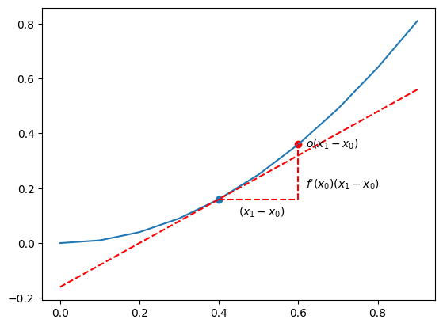

# Math Cheatsheet for ML
- [Math Cheatsheet for ML](#math-cheatsheet-for-ml)
  - [**Calculus**](#calculus)
    - [Gradient](#gradient)
    - [Taylor Expansion](#taylor-expansion)
    - [Lagrange Multiplier](#lagrange-multiplier)
  - [**Linear Algebra**](#linear-algebra)
    - [Least Squares](#least-squares)
    - [Determinant](#determinant)
      - [3 basic properties](#3-basic-properties)
      - [derived properties](#derived-properties)
      - [how to calculate](#how-to-calculate)
    - [Eigenvalues \& Eigenvectors](#eigenvalues--eigenvectors)
    - [Singular Value Decomposition (SVD)](#singular-value-decomposition-svd)
  - [**Probability**](#probability)
    - [Maximum Likelihood Estimation (MLE)](#maximum-likelihood-estimation-mle)
  - [**Information Theory**](#information-theory)
    - [Entropy](#entropy)

## **Calculus**

### Gradient

def $z = f(x,y)$ a function with two dimensional input $x,y$

$\nabla f = (\frac{\partial f}{\partial x}, \frac{\partial f}{\partial y})$ formula of the function's gradient, **output**:
- is a **vector** in the input space.
- go to the **direction** where goes **upward** fastest.
- **magnitude** (length) is the gradient of this direction.

$\nabla f(x_1,y_1) = (\frac{\partial f(x_1,y_1)}{\partial x}, \frac{\partial f(x_1,y_1)}{\partial y})$ function's gradient at $(x_1,y_1)$

in addition:

- $ \quad \nabla f(x,y) + \nabla g(x,y) \\
= (\frac{\partial f(x,y)}{\partial x} + \frac{\partial g(x,y)}{\partial x}, \frac{\partial f(x,y)}{\partial y} + \frac{\partial g(x,y)}{\partial y}) \\
= (\frac{\partial f(x,y) + g(x,y)}{\partial x},\frac{\partial f(x,y) + g(x,y)}{\partial y}) \\
= \nabla (f(x,y) + g(x,y))$

- $\nabla(fg) = f\nabla g + g\nabla f$
- $\nabla(\frac{f}{g}) = \frac{g\nabla f - f\nabla g}{g^2}$

### Taylor Expansion
for a given $y = f(x)$

$f(x_1)-f(x_0) = f'(x_0)(x_1-x_0) + o(x_1-x_0)$

then we get:

$f(x_1)-f(x_0) = f'(x_0)(x_1-x_0) + \frac{f''(x_0)}{2!}(x_1-x_0)^2 + \frac{f^3(x_0)}{3!}(x_1-x_0)^3 + ... + \frac{f^n(x_0)}{n!}(x_1-x_0)^n + ...$

then we get:

$f(x_1) = f(x_0) + f'(x_0)(x_1-x_0) + \frac{f''(x_0)}{2!}(x_1-x_0)^2 + \frac{f^3(x_0)}{3!}(x_1-x_0)^3 + ... + \frac{f^n(x_0)}{n!}(x_1-x_0)^n + ...$

$n \to \infty$

or: 

$f(x) = f(0) + f'(0)x + \frac{f''(0)}{2!}x^2 + \frac{f^3(0)}{3!}x^3 + ... + \frac{f^n(0)}{n!}x^n + ...$

$n \to \infty$

### Lagrange Multiplier

**Q1**: constrain $g(x,y) = 0$, find extreme value of $f(x,y)$

$\to$ (at extreme value point $(x_0,y_0)$, $\nabla f(x_0,y_0)$ and $\nabla g(x_0,y_0)$ should have same or opposite direction)

$\to$ $\nabla f(x_0,y_0) = \lambda \nabla g(x_0,y_0), \lambda \in R$

$\to$ def $F(x,y) = f(x,y) - \lambda g(x,y)$, $\nabla F(x_0,y_0) = \vec{0}$

$\to$ solve the equations:
$\quad\nabla F(x_0,y_0) = \vec{0} \quad g(x,y) = 0$

**Q2**: constrains $g_1(x,y) = 0$, $g_2(x,y) = 0$, find extreme value of $f(x,y)$

$\to$ $F(x,y) = f(x,y) - \lambda_1 g_1(x,y) - \lambda_2 g_2(x,y)$

$\to$ ...

## **Linear Algebra**

### Least Squares
There are $m$ data, each with $n$ features.

Data: $X_{m\times (n+1)} = \begin{bmatrix}
  1 & x_{11} & x_{12} & ... & x_{1n}\\
  1 & x_{21} & x_{22} & ... & x_{2n}\\
  ... & ... & ... & ... & ...\\
  1 & x_{m1} & x_{m2} & ... & x_{mn}
\end{bmatrix}$

Label: $Y_{m \times 1} = \begin{bmatrix}
  y_1\\
  y_2\\
  ...\\
  y_m
\end{bmatrix}$

to predict $\hat{y} = \theta_0 + \theta_1x_1 + \theta_2x_2 + ... + \theta_nx_n$, construct: $\theta_{(n+1) \times 1} = \begin{bmatrix}
  \theta_0\\
  \theta_1\\
  ...\\
  \theta_n
\end{bmatrix}$

therefore $\hat{Y} = X\theta$

we want least square error, loss function $L = \frac{1}{2}(X\theta - Y)^T(X\theta - Y)$ to be minimized.

$\to\frac{\partial L}{\partial \theta} = 0$

$\to\theta = (X^TX)^{-1}X^TY$

### Determinant
**square** matrix $A$, its determinant $\det A$ is a number, $A = \begin{bmatrix}
  a & b\\
  c & d
\end{bmatrix}$, $\det A = \begin{vmatrix}
  a & b\\
  c & d
\end{vmatrix}$

#### 3 basic properties
- $\det I = 1$

- row exchanges, sign changes: eg. $\begin{vmatrix}
  c & d\\
  a & b
  \end{vmatrix} = - \begin{vmatrix}
  a & b\\
  c & d
  \end{vmatrix}$

- add vector in row, add determinant in row: eg. $\begin{vmatrix}
  a + a' & b + b'\\
  c & d
  \end{vmatrix} = \begin{vmatrix}
  a & b\\
  c & d
  \end{vmatrix} + \begin{vmatrix}
  a' & b'\\
  c & d
  \end{vmatrix}$

#### derived properties
- if $A$ is singular, then $\det A = 0$.
- ...

#### how to calculate
$A = \begin{bmatrix}
  a & b\\
  c & d
\end{bmatrix}, \det A = ad - bc$

If: $A = \begin{bmatrix}
  a_{11} & a_{12} & ... & a_{1n}\\
  a_{21} & a_{22} & ... & a_{2n}\\
  ... & ... & ... & ...\\
  a_{n1} & a_{n2} & ... & a_{nn}
\end{bmatrix}$

let: $M_{ij} = \begin{bmatrix}
  a_{11} & ... & a_{1(j-1)} & a_{1(j+1)} & ... & a_{1n}\\
  ... & ... & ... & ... & ... & ...\\
  a_{(i-1)1} & ... & a_{(i-1)(j-1)} & a_{(i-1)(j+1)} & ... & a_{(i-1)n}\\
  a_{(i+1)1} & ... & a_{(i+1)(j-1)} & a_{(i+1)(j+1)} & ... & a_{(i+1)n}\\
  ... & ... & ... & ... & ... & ...\\
  a_{n1} & ... & a_{n(j-1)} & a_{n(j+1)} & ... & a_{nn}
\end{bmatrix}$

let: $c_{ij} = (-1)^{j + 1} \det M_{ij}$

then: $\det A = \sum_{r = 1}^{n} a_{ir}c_{ir}$

in another word: $\det A = a_{11}\det M_{11} - a_{12}\det M_{12} + a_{13}\det M_{13} - ... + (-1)^{n+1} a_{1n}\det M_{1n}$

### Eigenvalues & Eigenvectors
**square** matrix $A$, its eigenvalue $\lambda$ its eigenvector $v$, $Av = \lambda v$.

$\to (A - \lambda I) v = 0$

$v$ other than $ 0 \to (A - \lambda I)$ singular

$\to \det(A - \lambda I) = 0$

### Singular Value Decomposition (SVD)

## **Probability**

### Maximum Likelihood Estimation (MLE)

## **Information Theory**

### Entropy

